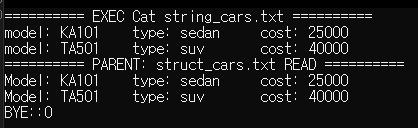

# 하계 SW 역량 강화 리눅스 시험

## 문제 설명
Cars 구조체를 입력받고 `struct_cars.txt`, `string_cars.txt` 파일을 입력하는 프로그램을 작성하시오.

### 조건
1) argument가 2개가 아닐 시 프로그램 종료  
2) 명령어 인자 값은 구조체 생성 개수이며 개수만큼 구조체 데이터 입력받기  
3) fork를 사용하여 자식 프로세스 2개를 생성 후 하나의 자식은 Car struct 형식으로 struct_cars.txt에 파일 쓰기, 다른 하나의 자식은 buffer에 입력된 문자열 형식으로 string_cars.txt에 파일 쓰기
   - 파일이 없다면 생성하고 쓰기모드, 파일 쓸 때 이어서 쓰는 옵션 사용해서 파일 열기
4) 부모 프로세스는 2개의 자식들이 파일 입력 후 종료를 기다린 후 자식 프로세스 생성  
5) 자식 프로세스는 EXEC를 사용하여 cat string_cars.txt 실행  
6) 위의 자식 프로세스 종료를 기다린 후 struct_cars.txt 파일을 읽고 아래와 같은 형식으로 터미널에 출력

### 결과
- argument가 없을 시 argument 요청

    

- ex. argument에 2 입력 시 결과

    

## 1번 심화
- argument가 없을 시에는 읽기 모드로만 작동하도록 프로그램 구현  
- **HINT:** 구조체 파일의 동일한 값만 사용!!

    

---

## Linux 총정리 문제 함수 설명

### `malloc`
- 명령행에서 받은 인자가 구조체의 개수이므로, 입력받은 수만큼 구조체 메모리 공간을 동적 할당
- `malloc`은 할당한 메모리의 시작 주소를 반환하므로 구조체 포인터로 받음

### `sizeof`
1. 메모리 동적 할당할 때  
   - (한 구조체의 메모리 크기) × (입력받은 수) 만큼 할당하기 위해 사용  
2. 파일에 구조체 작성/읽기할 때  
   - 작성: (한 구조체 크기) × (입력받은 수)만큼 작성  
   - 읽기: 구조체 하나씩 읽기 위해 `sizeof` 사용

### `sprintf`
- `scanf`로 입력받은 값을 문자열에 저장하기 위해 사용

### `strcat`
- `buffer`(문자열)에 `sprintf`로 저장된 문자열을 이어 붙이기 위해 사용  
- 반복문을 통해 모든 입력값을 `buffer`에 저장

### `open`
- 파일 열기 함수

| 모드 | 설명 |
|------|------|
| `O_RDONLY` | 읽기 전용 개방 (부모 프로세스에서 사용) |
| `O_WRONLY` | 쓰기 전용 개방 (자식 프로세스에서 사용) |
| `O_CREAT`  | 파일 없으면 생성 (자식 프로세스에서 사용) |
| `O_APPEND` | 기존 내용 뒤에 이어 작성 (자식 프로세스에서 사용) |

- `0644`: 파일 접근 권한 설정  
  - 사용자: 읽기/쓰기 가능  
  - 그룹/기타 사용자: 읽기 가능

### `write`
1. 문자열 작성  
   - `write(fd, buffer, strlen(buffer))`  
   - `string_cars.txt` 파일에 `strcat`으로 저장된 `buffer`를 작성  
2. 구조체 작성  
   - `write(fd, (struct Cars*)c, sizeof(struct Cars) * structnum)`  
   - 동적 할당된 구조체 포인터를 파일에 저장

### `read`
- 파일에 저장된 내용을 읽기 위해 사용  
- 구조체 하나씩 읽기 위해 `sizeof` 사용

### `perror`
- 파일 오픈 실패 시 오류 메시지 출력

### `execlp`
- `cat string_cars.txt` 실행 위해 사용  
- `p`가 있으므로 경로 제외하고 "cat"으로 작성

### `fork`
- 자식 프로세스 생성  
- 자식 2개 생성 후 `if`로 각 프로세스 역할 분기

### `exit`
- 자식 프로세스를 종료할 때 사용  
- 인자는 부모에게 전달되는 상태 값

### `wait`
- 자식 프로세스가 종료할 때까지 부모를 대기  
- 자식이 파일 작성 완료한 후 부모가 동작하도록 설정
